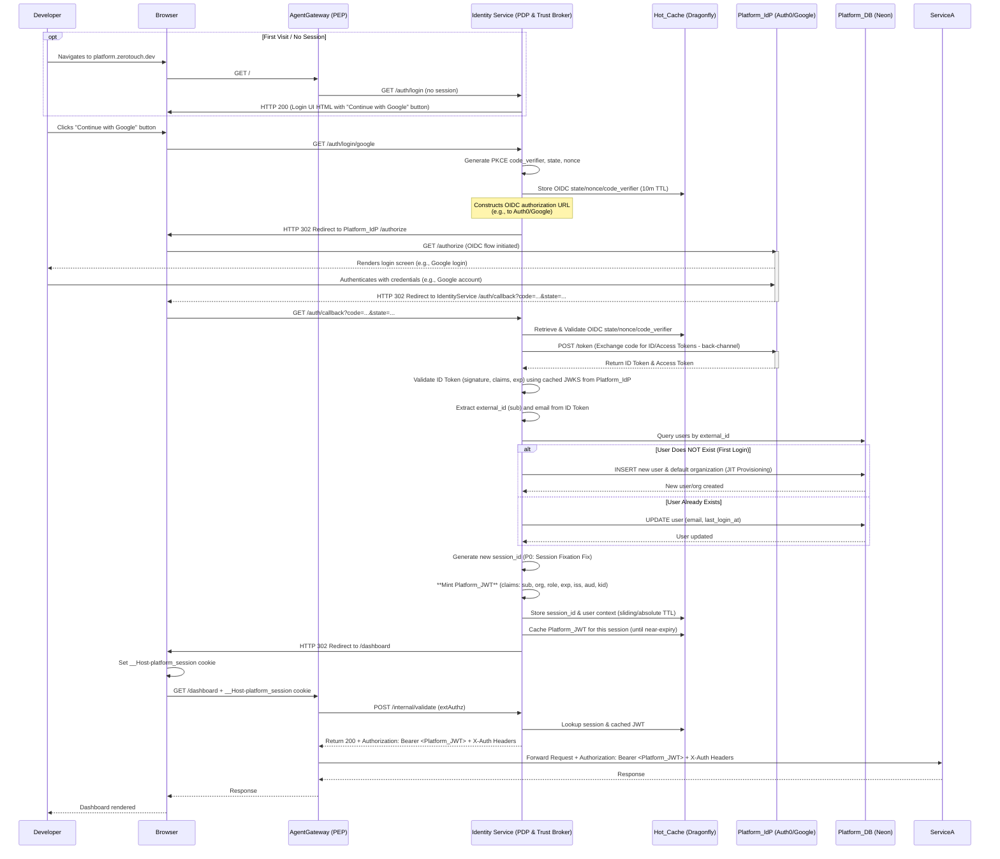
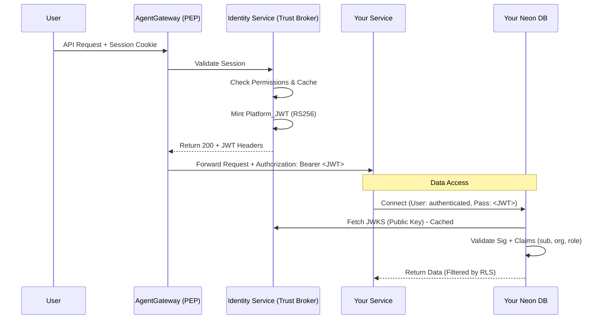

# ADR 004: Centralized Trust Broker & Database Authentication

**Status:** Accepted  
**Date:** January 2025  
**Context:** Multi-Service Architecture, Zero-Touch Platform  
**Applies To:** All Backend Services, Database Architecture

## 1. Context & Problem Statement
In a microservices environment, managing authentication and authorization across multiple services and databases creates significant operational friction:
1.  **Credential Sprawl:** Managing static database passwords for every service and rotating them is a security risk and an operational burden.
2.  **Identity Fragmentation:** If Service A calls Service B, Service B needs a reliable way to verify the user's identity without re-authenticating with the IdP.
3.  **Data Isolation:** Databases need to enforce tenancy (Organization ID) and permissions (Role) at the data layer (Row Level Security), not just the application layer.

## 2. The Decision
We adopt a **Centralized Trust Broker** architecture using **Standard OIDC/JWTs**.

1.  **One Mint:** The `Identity Service` is the *sole* authority allowed to sign authentication tokens (`Platform_JWT`).
2.  **The JWT is the Password:** Downstream services authenticate to their databases (Neon) using the `Platform_JWT` as the password.
3.  **Decentralized Validation:** Services and Databases validate tokens locally by fetching the public key (JWKS) from the Identity Service.
4.  **Service-to-Service via API:** Services must **never** connect directly to another service's database. Data exchange happens via HTTP APIs, propagating the user's JWT.

The proposal is Idiomatic. It shifts complexity away from "Day 2 Operations" (rotating 50 passwords) to "Day 1 Architecture" (setting up OIDC), which is exactly what the Solo Founder Test demands.

## 3. Architecture

Let's break down the "Create Account" flow and then address the crucial distinction between the JWTs minted by your **Identity Service** and how **Neon Auth** uses them.

---

## 1. Sequence Diagram: "Create Account" Flow

This diagram outlines the complete flow for a *new* developer signing up for the platform, from first visit to successful session establishment.



---

## 2. JWT Key Bootstrap and Management

**CRITICAL: Day 0 Key Generation Workflow**

Before the Identity Service can start, JWT keypairs must exist in AWS SSM. This is handled automatically during cluster creation:

**Automated Bootstrap Process:**
1. During `inject-secrets.yml` workflow execution, check if JWT keys exist in SSM
2. If keys don't exist, generate new RS256 keypair using `openssl genrsa`
3. Store private key, public key, and key ID in SSM at:
   - `/zerotouch/{env}/identity-service/jwt_private_key`
   - `/zerotouch/{env}/identity-service/jwt_public_key`
   - `/zerotouch/{env}/identity-service/jwt_key_id`
4. ExternalSecrets Operator syncs keys from SSM to Kubernetes Secrets
5. Identity Service loads keys from Kubernetes Secrets at startup

**JWT Roles and Key Ownership:**

*   **Platform_IdP (e.g., Neon Auth/Google):**
    *   **Role:** Authenticates the *human developer* via OAuth/OIDC provided by the Neon Auth URL.
    *   **Output:** Session data with verified identity (user_id, email)
    *   **Keys:** Uses *its own* keys (managed by provider)
    *   **Identity Service Action:** Validates provider session, extracts user identity

*   **Identity Service (Your Node.js app):**
    *   **Role:** *Mints* the `Platform_JWT` (your *internal* token) that all backend services and databases trust
    *   **Output:** A `Platform_JWT` signed with RS256
    *   **Keys:** Uses *its own unique* RS256 keypair generated during bootstrap
    *   **Key Storage:** Private key in AWS SSM (encrypted), public key exposed via JWKS endpoint
    *   **JWKS Endpoint:** Exposes `/.well-known/jwks.json` provided by the Neon JWKS URL for services/databases to verify Platform_JWT signatures

*   **Neon Database (with Neon Auth enabled):**
    *   **Role:** *Validates* the `Platform_JWT` it receives from services as a password
    *   **Input:** The `Platform_JWT` (minted by Identity Service)
    *   **Keys:** Fetches Identity Service's *public key* from `/.well-known/jwks.json` provided by the Neon JWKS URL.
    *   **Configuration:** One-time setup via Neon API during cluster bootstrap (automated)

**Key Principle:** The Identity Service is the sole internal JWT issuer. External providers only verify human identity; they do not issue Platform_JWTs.

This model is robust because:
*   The `Identity Service` is the *single point of trust* for creating internal platform sessions.
*   The `Platform_IdP` (e.g., Google/Auth0) only verifies the *human*.
*   `Neon Auth` only verifies the *machine/service* attempting to connect, by checking the JWT's signature against the public key issued by your `Identity Service`.

### The Flow of Trust



### The `Platform_JWT` Standard
All internal communication relies on this token structure.

```json
{
  "iss": "https://platform.zerotouch.dev",
  "sub": "user_uuid_123",        // User ID
  "org": "org_uuid_456",         // Organization ID (Tenancy)
  "role": "developer",           // RBAC Role
  "aud": "platform-services",
  "exp": 1700000000              // Expiration (Short-lived: 5-15m)
}
```

## 4. Implementation Guidelines for Product Teams

### A. Database Configuration (Neon)
Neon database authentication is configured automatically during cluster bootstrap via Neon API:

**Automated Configuration (via bootstrap script):**
```bash
# scripts/bootstrap/infra/02-configure-neon-auth.sh
# Runs during cluster creation, configures Neon Auth programmatically

curl -X POST "https://console.neon.tech/api/v2/projects/${NEON_PROJECT_ID}/auth/providers" \
  -H "Authorization: Bearer ${NEON_API_KEY}" \
  -d '{
    "type": "external",
    "jwks_url": "https://platform.zerotouch.dev/.well-known/jwks.json",
    "audience": "platform-services"
  }'
```

**Manual Configuration (for development/testing only):**
1. Go to Neon Console → Project → **Authentication** settings
2. Add an **External Provider**
3. **JWKS URL:** `https://platform.zerotouch.dev/.well-known/jwks.json` (or environment-specific URL)
4. **Audience:** `platform-services`
5. Enable **Row Level Security (RLS)** on your tables to use the `org` claim for isolation

**RLS Parameter Verification (REQUIRED before deployment):**
```sql
-- Test JWT claims parameter name in Neon SQL Editor
SELECT current_setting('request.jwt.claims', true);
-- If returns NULL, try alternative:
SELECT current_setting('neon.jwt_claims', true);
-- Update RLS policies with correct parameter name
```

### B. Service Implementation (Node.js/Python/Go)
Your service does **not** need a static database password in `secrets`.

**How to connect:**
1.  Initialize a connection pool once at application startup.
2.  Read the `Authorization` header from incoming requests.
3.  Use the JWT as the password when acquiring connections from the pool.

**Node.js Example:**
```javascript
// Initialize pool once at startup (src/infrastructure/database.ts)
import { Pool } from 'pg';

const pool = new Pool({
  host: process.env.DATABASE_HOST,
  user: 'authenticated',           // Standard Neon role
  database: 'my_service_db',
  max: 3,                          // Fixed pool size for HPA safety
  idleTimeoutMillis: 10000,        // Aggressive for serverless
  connectionTimeoutMillis: 5000,
});

// In your route handler - pool handles connection reuse
const token = req.headers.authorization.split(' ')[1];

// Neon's proxy handles JWT multiplexing - pool provides connection reuse
const client = await pool.connect();
try {
  // Execute query with JWT-authenticated connection
  const result = await client.query('SELECT * FROM my_table WHERE org_id = $1', [orgId]);
} finally {
  client.release();
}
```

**Important:** Neon's serverless proxy handles JWT multiplexing across connections. The pool provides connection reuse while Neon manages the JWT authentication layer.

### C. Service Account Tokens (Machine-to-Machine)
For background jobs, cron tasks, and queue workers that don't have user sessions:

**Status:** Not implemented in MVP - deferred to post-launch
**Interim Solution:** Use shared `MACHINE_AUTH_KEY` for internal service authentication

**Future Implementation (Post-MVP):**
```javascript
// POST /auth/machine - Service Account Token Endpoint
class ServiceAccountManager {
  async mintServiceToken(serviceId: string, orgId: string, permissions: string[]) {
    // Validate service identity via MACHINE_AUTH_KEY (MVP)
    // Future: Validate via mutual TLS or Kubernetes ServiceAccount tokens
    await this.validateServiceIdentity(serviceId);
    
    return jwt.sign({
      sub: `service:${serviceId}`,           // e.g., "service:cron-reports"
      org: orgId,
      role: 'system',
      permissions,                          // Specific capabilities array
      iss: 'https://platform.zerotouch.dev',
      aud: 'platform-services',
      exp: Math.floor(Date.now() / 1000) + (24 * 60 * 60) // 24h for background jobs
    }, JWT_PRIVATE_KEY);
  }
}
```

**Background Job Usage:**
```javascript
// Cron Job / Queue Worker Implementation
class ReportGenerator {
  async generateDailyReport(orgId: string) {
    // Request service token from Identity Service
    const serviceToken = await this.identityClient.getServiceToken(
      'cron-reports', 
      orgId, 
      ['read:analytics', 'write:reports']
    );
    
    // Use service token to access database
    const db = new Client({
      host: process.env.DATABASE_HOST,
      user: 'authenticated',
      password: serviceToken,  // Service JWT as password
      database: 'analytics_db'
    });
    
    await db.connect();
    // Generate report with system permissions
    await db.end();
  }
}
```

### D. Standard RLS Policy Template
To ensure consistent tenant isolation and permission enforcement across all services, use this standardized RLS policy:

```sql
-- Standard RLS Policy Template for all tables
-- Replace ${table_name} with your actual table name
-- CRITICAL: Verify Neon's JWT claims parameter name before deployment
-- Test with: SELECT current_setting('request.jwt.claims', true);
-- If NULL, try: SELECT current_setting('neon.jwt_claims', true);
-- Update parameter name below based on test results
CREATE POLICY tenant_isolation ON ${table_name}
  FOR ALL TO authenticated
  USING (
    -- Tenant Isolation: Must match organization
    org_id = (current_setting('request.jwt.claims', true)::json->>'org')::uuid
    AND
    -- Role-Based Access Control
    CASE 
      -- System services have full access within org
      WHEN (current_setting('request.jwt.claims', true)::json->>'role') = 'system' THEN true
      -- Owners have full access to org data
      WHEN (current_setting('request.jwt.claims', true)::json->>'role') = 'owner' THEN true
      -- Admins have full access to org data
      WHEN (current_setting('request.jwt.claims', true)::json->>'role') = 'admin' THEN true
      -- Developers can only access their own records
      WHEN (current_setting('request.jwt.claims', true)::json->>'role') = 'developer' THEN 
        user_id = (current_setting('request.jwt.claims', true)::json->>'sub')::uuid
      -- Viewers have read-only access (implement in application logic)
      WHEN (current_setting('request.jwt.claims', true)::json->>'role') = 'viewer' THEN true
      -- Deny all other cases
      ELSE false
    END
  );

-- Enable RLS on the table
ALTER TABLE ${table_name} ENABLE ROW LEVEL SECURITY;

-- Grant access to authenticated role
GRANT SELECT, INSERT, UPDATE, DELETE ON ${table_name} TO authenticated;
```

**RLS Policy Variations by Use Case:**
```sql
-- For user-owned resources (projects, files, etc.)
CREATE POLICY user_owned_resources ON projects
  FOR ALL TO authenticated
  USING (
    org_id = (current_setting('request.jwt.claims', true)::json->>'org')::uuid
    AND (
      (current_setting('request.jwt.claims', true)::json->>'role') IN ('system', 'owner', 'admin')
      OR owner_id = (current_setting('request.jwt.claims', true)::json->>'sub')::uuid
    )
  );

-- For shared org resources (teams, settings, etc.)
CREATE POLICY shared_org_resources ON teams
  FOR ALL TO authenticated
  USING (
    org_id = (current_setting('request.jwt.claims', true)::json->>'org')::uuid
    AND (current_setting('request.jwt.claims', true)::json->>'role') IN ('system', 'owner', 'admin', 'developer')
  );

-- For read-only resources (public data, templates, etc.)
CREATE POLICY public_read_resources ON templates
  FOR SELECT TO authenticated
  USING (
    org_id = (current_setting('request.jwt.claims', true)::json->>'org')::uuid
    OR is_public = true
  );
```

### E. Cross-Service Communication
If `Service A` needs data from `Service B`:
1.  **DO NOT** connect to `Service B`'s database.
2.  **DO** call `Service B`'s HTTP API.
3.  **MUST** forward the original `Authorization` header.

```javascript
// Service A calling Service B
const response = await fetch('http://service-b/api/data', {
  headers: {
    'Authorization': req.headers.authorization // Propagate trust
  }
});
```

## 5. Consequences

### Positive
*   **Security:** No long-lived database credentials to leak or rotate.
*   **Simplicity:** No need to manage user synchronization between services; the token carries the context.
*   **Isolation:** Database RLS is enforced based on the signed token, preventing logic bugs from leaking tenant data.
*   **Vendor Agnostic:** Uses standard OIDC/JWT. Can switch DB providers (if they support OIDC) or Identity providers without changing service code.
*   **Background Jobs:** Service account tokens enable system operations without user sessions.
*   **Consistent Security:** Standardized RLS policies ensure uniform tenant isolation across all services.

### Negative
*   **Token Expiry:** User tokens are short-lived. Long-running background jobs use service account tokens (24h TTL).
*   **Latency:** Slight overhead for DB to validate JWT (mitigated by Neon's internal caching of keys).
*   **RLS Complexity:** Debugging requires understanding of Row Level Security behavior and standardized policies.
*   **Neon Dependency:** Architecture optimized for Neon's JWT-auth capabilities; migration to standard Postgres requires proxy layer.

This architecture is considered **Best-in-Class for Modern Data-Intensive SaaS** platforms (like Supabase, Hasura, and parts of Retool).

It represents a shift from **Application-Side Authorization** (logic in Node.js) to **Database-Side Authorization** (Row Level Security protected by JWTs).

However, "Best-in-Class" comes with specific trade-offs. Here is the unvarnished analysis of the Cons and Risks you will face, so you can decide with eyes open.

---

### The Architecture: "The Authenticated Proxy"
You are essentially treating your Microservices as "dumb pipes" and your Database as the "Policy Enforcer."

### Why it is "Production Grade"
1.  **Defense in Depth:** If a hacker exploits a vulnerability in your Node.js code (e.g., Remote Code Execution) and gets access to the container, **they cannot dump the database.** They only have the JWT of the current user, so they can only steal *that specific user's* data.
2.  **Performance:** Authorization logic happens in PostgreSQL (compiled C code), which is often faster than fetching data, hydrating ORM objects, and checking permissions in Node.js/Python.
3.  **Unified Logic:** Your permission logic lives in one place (SQL Policies), not scattered across 15 microservices.

---

### The Cons (and How to Handle Them)

#### 1. The "Background Job" Problem (SOLVED)
**The Issue:**
Your architecture relies on an incoming User JWT to authenticate to the DB.
*   **Scenario:** A cron job runs at 2 AM to generate a daily report.
*   **Problem:** There is no user logged in. There is no JWT. The service cannot connect to Neon using the "standard" path.

**The Fix (IMPLEMENTED):**
Service Account Tokens with dedicated endpoint.
*   **Solution:** The Identity Service exposes `POST /auth/machine` where trusted internal services can request long-lived (12h-24h) "Service JWTs" (e.g., `sub: service:cron-reports`, `role: system`) signed with the same key.
*   **ZeroTouch Implementation:** Your `AgentExecutor` (running NATS jobs) requests a "System Token" from the Identity Service to perform background work with appropriate org-scoped permissions.

#### 2. Debugging Complexity (MITIGATED)
**The Issue:**
When a query returns 0 rows, is it a bug in the `WHERE` clause, or is it Row Level Security (RLS) silently filtering the data?
*   **Traditional:** You log `user.role` in Node.js and see "Oh, he's not an admin."
*   **Neon/RLS:** The DB just returns an empty result set. The logs look successful.

**The Fix (STANDARDIZED):**
Consistent RLS policies and debugging workflows.
*   **Solution:** Standardized RLS policy templates ensure predictable behavior. You can temporarily connect as a "superuser" (bypassing RLS) to check if data exists vs connecting as the "user" to see if RLS is filtering it.
*   **Implementation:** All services use the same RLS policy template, making debugging patterns consistent across the platform.

#### 3. Connection Pooling Strategy (Optimized for Neon)
**The Architecture:**
Services use fixed-size connection pools (max: 3 per pod) with Neon's serverless proxy handling JWT multiplexing.

**How It Works:**
*   **Service Layer:** Each pod maintains a small connection pool (3 connections)
*   **Neon Proxy:** Aggregates connections across all pods and handles JWT authentication
*   **Scaling:** HPA scales pods horizontally; Neon proxy aggregates connections vertically
*   **Result:** 20 pods × 3 connections = 60 connections to Neon proxy (manageable)

**Why This Works:**
*   Fixed pool size prevents connection exhaustion during HPA scaling
*   Neon's proxy is designed for serverless workloads with JWT authentication
*   Connection reuse within pod reduces authentication overhead
*   Aggressive idle timeout (10s) releases unused connections quickly

**Migration Warning:**
If migrating to standard PostgreSQL (RDS), you will need:
*   PgBouncer in "Transaction Mode" with custom JWT handling
*   OR redesign to use static service account credentials
*   Neon's JWT multiplexing is a unique capability not available in standard Postgres

#### 4. Schema Coupling
**The Issue:**
Your Database Schema now knows about your Authentication Schema.
*   Your SQL `CREATE POLICY` statements will reference specific JWT claims (e.g., `auth.jwt() -> 'org_id'`).
*   If you change your JWT structure in the Identity Service, you break the Database.

**The Fix:**
Strict governance on the JWT Token contract (which you have already defined in `design.md`). Treat the JWT structure as a public API that cannot have breaking changes.

---

### Comparison: Is this like Retool?

| Feature | Your Approach (Neon Auth) | Retool / Traditional Enterprise |
| :--- | :--- | :--- |
| **Connection** | Per-User JWT | Single "Service Account" |
| **Auth Logic** | Postgres RLS Policies | Application Code (Middleware) |
| **Security** | High (Leak limited to user) | Moderate (Leak exposes DB) |
| **Complexity** | High (SQL + JWT sync) | Moderate (Code logic) |
| **Scalability** | Relies on Neon Proxy | Relies on App Caching |

### Verdict

**Proceed.**
For a **Solo Founder** building a platform on **Neon**, this is the correct choice.
*   It saves you from writing thousands of lines of permission logic in Node.js.
*   It leverages the specific superpower of your chosen vendor (Neon).

**Just remember:** When you write your `cronjob` or `KEDA` worker logic later, you will need to implement a "Machine-to-Machine" token flow so those headless services can talk to the database.